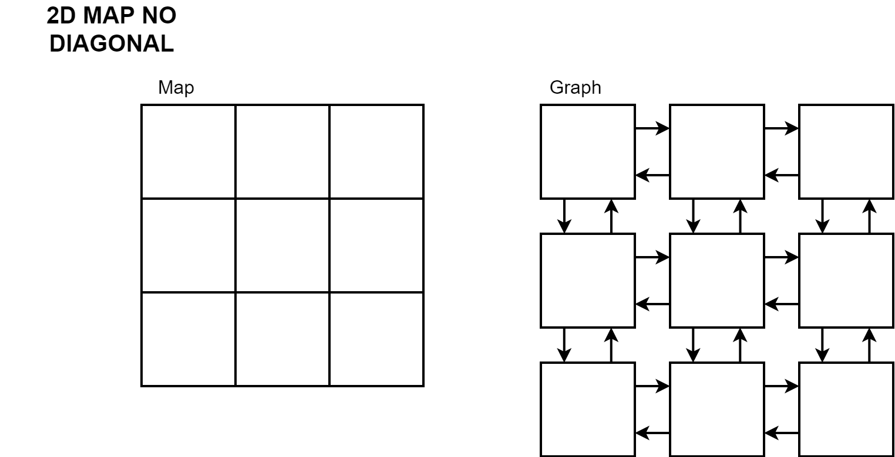

# MAP-PACER - multiple agents path planing algorithms using cloud and edge resources

## Description

Comparison of path planning algorithms for multiple robots based on edge-cloud collaborative computing, cloud computing, and local computing

## Initial idea


## Services architecture


## Local testing
1) Install vagrant and virtualbox
2) Use pre configured [machine](https://github.com/mactat/dev-vm)
3) Start ssh session to machine: 
```
ssh dev-vm@localhost -p 2222
```
4) Clone repo
5) Use tilt for development and testing
```bash
tilt up
```

This includes live cde changes and automatic deployment to local kubernetes cluster managed by `kind`.

## General development
```bash
For spinning dev-env, tilt, kind and ctlptl has to be configured.
For cloud development add '.env' file with:
AZURE_SUBSCRIPTION_ID, AZURE_GROUP_NAME, AZURE_CLUSTER_NAME, DOCKER_TOKEN, DOCKER_USERNAME

Usage:
	make dev                    run dev cluster and tilt
	make clean                  stop local cluster and tilt
	make cloud-login            login to azure and setup kubectl
	make cloud-up               start kubernetes cluster in azure
	make cloud-down             stop kubernetes cluster in azure
	make cloud-deploy           deploy to kubernetes cluster in azure
	make cloud-build			build and push docker images
```

## Algorithms
```bash
# Basic A*, Dijkstra, BFS
# Advanced CA*
```

## Map
Maps are set to be grid based and are represented as 2D array of integers. Each integer represents a cell in the grid. Those grids are transformed into graphs and then used for path planning.

Planning can be based on 2D maps(representing just space) or 3D maps(representing both time and space).

### Principle of graph creation for 2D map:



### Principle of graph creation for 3D map:


### Head collision problem for CA* algorithm:


### Example of solved map for single agent:
